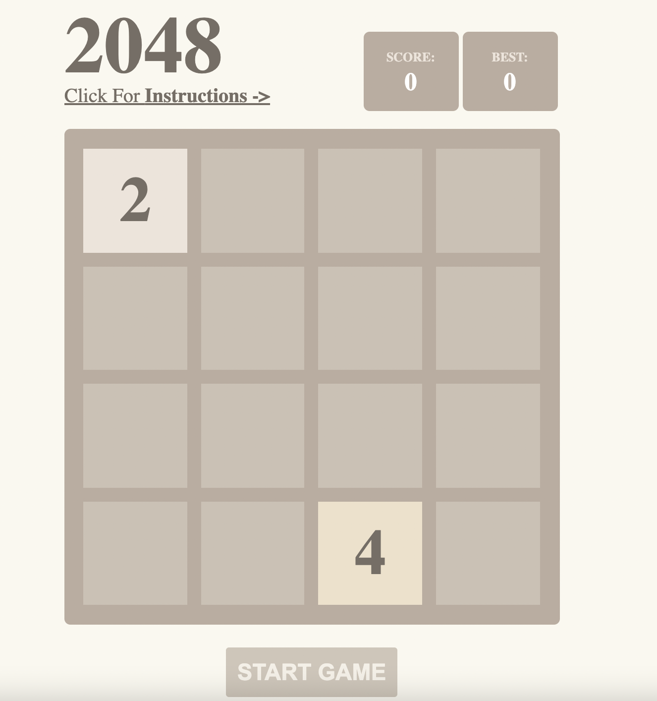
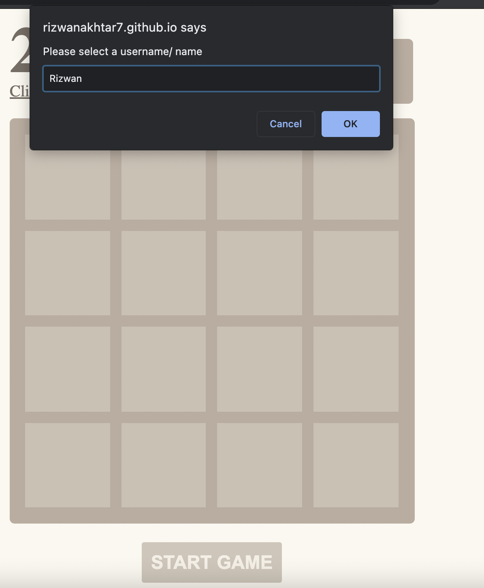

# Project 1: Tetris
## Timeframe : *1 week*
### Goal: 
Create fully functioning game using HTML, CSS & JavaScript 
## Technologies Applied:
### 
- HTML5
- CSS3
- JavaScript(Vanilla & ES6)
- Git
- GitHub
- Google Fonts
- Animate.css library

## Overview:
This was my first project at General Assembly, given just over a week to build a game. I chose 2048, which was one of the toughest games in difficuly out of the options given. Understanding the challenges of implementing the game helped me understand how to allocate my time during the project accordingly. I enjoyed playing this game on IPhone, so both the challenge and love of the game allowed me to jump right in to developing this game.


*link to implementation*
https://play2048.co/

My Deployed version : https://rizwanakhtar7.github.io/project-1/




### Controls
- Click **Start Game** button to play & enter a username to play as :


- Use Arrow Keys (left, right, up, down) to move the squares accordingly
- Goal is to build 2048 to win OR score highest score to earn place on leadership board
- Squares with the same number merge into one when they touch

### Day One:
* Pseudocoding and sign off with steps:
- Create 4 by 4 grid 
- Render random numbers (2 or 4) per keyboard move
- if 2 and 2 OR 4 or 4 touch on grid for example, merge the two numbers. If 2 and 4, stack.
- if 2048, display winning message, if every cell filled - end game

### Day Two:
Focused on the random spot generator function to generate either a 2 or 4 on the grid and in a new blank space each time.

```function randomSpotAndNumberGenerator(width) {
  //If all grids have numbers populated then stop game 
  const isEveryCellPopulated = elements.cells.every((cell) => cell.innerHTML > 0)
  if (isEveryCellPopulated) {
    return gameOver()
  }

  //generate random number 2 or 4 from array
  const twoOrFourArr = [2, 4]
  const randomIdx = Math.floor(Math.random() * twoOrFourArr.length)
  const twoOrFourNumber = twoOrFourArr[randomIdx]
  const randomNumberOnGrid = Math.floor(Math.random() * (width ** 2))

  if (elements.cells[randomNumberOnGrid].innerHTML === '') {
    elements.cells[randomNumberOnGrid].className = 'Number'
    elements.cells[randomNumberOnGrid].innerHTML = twoOrFourNumber
    if (twoOrFourNumber === 2) {
      elements.cells[randomNumberOnGrid].classList.add('two')
    } else {
      elements.cells[randomNumberOnGrid].classList.add('four')
    }
  } else {
    randomSpotAndNumberGenerator(elements.width)
  }
}
```

### Day Two and Three:
Worked on the user swiping up, down, right, left. This was the toughest day as first I had to console log the direction of the key press to listen out for the direction the user clicked:

```

document.addEventListener('keydown', (event) => {
  const key = event.key
  if (key === 'ArrowDown') {
    moveGridsDownwards()
    randomSpotAndNumberGenerator(elements.width)
  } else if (key === 'ArrowUp') {
    moveGridsUpwards()
    randomSpotAndNumberGenerator(elements.width)
  } else if (key === 'ArrowLeft') {
    moveGridsLeft()
    randomSpotAndNumberGenerator(elements.width)
  } else if (key === 'ArrowRight') {
    moveGridsRight()
    randomSpotAndNumberGenerator(elements.width)
  }
})

```
After this I called a function for example the moveGridsDownwards which would take the numbers in that row or column and store in an array and call filter Array function to filter out the 0s. The resulting updated array would be filled with 0s and number merge calculated incase any numbers are the same and need to be added and merged together. The FinalSortedAndCombineCol function merged this final array together, filling it up with 0s for any gaps left

```
const FinalSortedAndCombinedCol = [...new Array(missingIndexesInArray).fill(0), ...fourthColPostCombineFilter]

  elements.cells[3].innerHTML = FinalSortedAndCombinedCol[0]
  elements.cells[3 + elements.width].innerHTML = FinalSortedAndCombinedCol[1]
  elements.cells[3 + (elements.width * 2)].innerHTML = FinalSortedAndCombinedCol[2]
  elements.cells[3 + (elements.width * 3)].innerHTML = FinalSortedAndCombinedCol[3]
  ```


### Day Four
On Day four, I achieved MVP, thoroughly testing the movements on each side the user swiped, along with this I spent time making sure the 2 and 4 were randomly generating on a place on the grid. I had an issue initially where the random spot was generating on an existing populated number which caused problems. I added a condition to fix this to make sure that the function ran only in a blank spot when called.
I spent the remaining days adding  the color classes to the different grid, motivated by the original game design. Along with this I implemented the best score functionality.

```
function addNumbClass() {
  elements.cells.forEach((grid) => {
    if (grid.innerHTML === '2048') {
      winner()
    }
    grid.classList.remove('two')
    grid.classList.remove('four')
    grid.classList.remove('eight')
    grid.classList.remove('sixteen')
    grid.classList.remove('thirty-two')
    grid.classList.remove('sixty-four')
    grid.classList.remove('higher_numbers')

    grid.classList.add('Number')
    if (grid.innerHTML === '0') {
      grid.classList.remove('two')
      grid.classList.remove('four')
      grid.classList.remove('eight')
      grid.classList.remove('sixteen')
      grid.classList.remove('thirty-two')
      grid.classList.remove('sixty-four')
      grid.classList.remove('higher_numbers')
      grid.innerHTML = ''
    } else if (grid.innerHTML === '2') {
      grid.classList.add('two')
    } else if (grid.innerHTML === '4') {
      grid.classList.add('four')
    } else if (grid.innerHTML === '8') {
      grid.classList.add('eight')
    } else if (grid.innerHTML === '16') {
      grid.classList.add('sixteen')
    } else if (grid.innerHTML === '32') {
      grid.classList.add('thirty-two')
    } else if (grid.innerHTML === '64') {
      grid.classList.add('sixty-four')
    } else {
      grid.classList.add('higher_numbers')
    }
  })
}
```

Additionally I styled:
- Borders
- Grid Color
- Score counter && Best Score


### Wins
- Achieving my targets throughout the week including MVP, styling goals and refactoring code as I went along.

- Pseudocoding, taking time to plan in detail helped me to write the code smoothly, testing throroughly as I went along developing the game.

### Challenges
- The biggest challenge for me was to correctly apply the function to swipe correctly.
- the merge calculator function to correctly  collapse the arrays on each side accordingly and calculate the sum.

### Learnings
- Problem Solving - This was the first project ever where I had to break down a complex problem and have a step by step approach to get to my goal independently.
- Solidifying the fundamental concepts of JS / CSS - I set myself a target to really solidify the concepts of variables, functions, loops and conditionals and CSS Flexbox and making the grids and game in general responsive.


### Features to Implement 
- Implement swiping for mobiles
- the score function to add animation in a more professional / attractive way
- different levels with different challenges

### Credits
- Nick Hayes SEI Instructor - for help creating the 4 by 4 grid responsively in JS
- https://play2048.co/
- https://animate.style/ for styling animations
